# System overview

COOKie — mobile-first система планирования питания. Клиент обращается к Caddy;
простые команды и ресурсы маршрутизируются в доменные API, а составные экраны —
в Mobile BFF. Stateful-сервисы изолируют данные в PostgreSQL и синхронизируют
локальные модели событиями NATS JetStream.

```mermaid
flowchart LR
    Client["Kotlin Multiplatform client"] --> Gateway["Caddy API Gateway"]
    Gateway --> BFF["Kotlin Mobile BFF"]
    Gateway --> Identity
    Gateway --> User
    Gateway --> FoodCatalog["Food Catalog"]
    Gateway --> Nutrition
    Gateway --> Recipe
    Gateway --> Shopping
    Gateway --> HealthData["Health Data Service"]
    Gateway --> Media
    Gateway --> MealPlanner["Meal Planner"]

    BFF --> User
    BFF --> Nutrition
    BFF --> Recipe
    BFF --> Progress

    Identity <--> Bus["NATS JetStream"]
    User <--> Bus
    FoodCatalog <--> Bus
    Nutrition <--> Bus
    Recipe <--> Bus
    Shopping <--> Bus
    HealthData <--> Bus
    Progress <--> Bus
    Notification <--> Bus
    Media <--> Bus
    MealPlanner <--> Bus

    DomainServices["Every stateful service"] --> PG["Owned PostgreSQL DB/schema"]
    DomainServices -->|when publishing events| Outbox["Transactional outbox"]
    DomainServices -->|when consuming events| Inbox["Idempotent inbox"]

    Gateway --> Redis
    FoodCatalog --> Redis
    Notification --> Redis
    Services["Backend services"] --> Grafana["Grafana observability"]
```

## Runtime roles inside a stateful service

- `API` принимает синхронные HTTP-запросы.
- `Processor Worker` выполняет локальную асинхронную работу.
- `Publisher Worker` отправляет pending outbox records в JetStream и существует
  только у event publisher.
- `Consumer Worker` применяет входящие события через inbox и существует только у
  event consumer. Identity v1 ничего не потребляет и не имеет этой роли.
- Специализированные workers допустимы там, где они явно нужны: scheduler и
  delivery в Notification, generator/processor в Meal Planner.

Это логические роли: решение о процессах, контейнерах и масштабировании пока не
принято.

## Health terminology

`Health Data Service` — доменный сервис веса и активности. Он не является
центральным сервисом проверки работоспособности. Caddy, Mobile BFF и каждый
backend runtime самостоятельно предоставляют `/healthz` и `/readyz` по общему
операционному контракту `contracts/openapi/runtime.yaml`.
