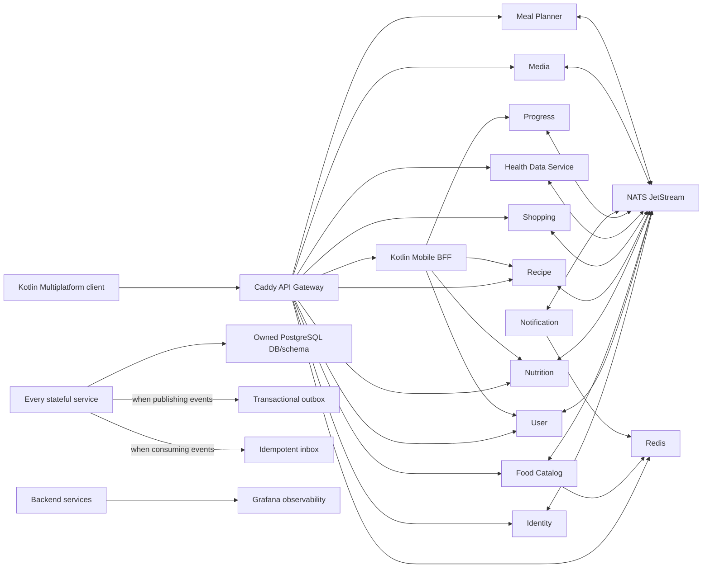
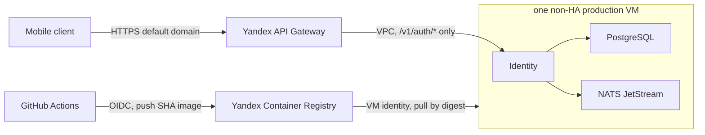

# System overview

COOKie — mobile-first система планирования питания. Клиент обращается к Caddy;
простые команды и ресурсы маршрутизируются в доменные API, а составные экраны —
в Mobile BFF. Stateful-сервисы изолируют данные в PostgreSQL и синхронизируют
локальные модели событиями NATS JetStream.

## Runtime roles inside a stateful service

- `API` принимает синхронные HTTP-запросы.
- `Processor Worker` выполняет локальную асинхронную работу.
- `Publisher Worker` отправляет pending outbox records в JetStream и существует
  только у event publisher.
- `Consumer Worker` применяет входящие события через inbox и существует только у
  event consumer. Identity v1 ничего не потребляет и не имеет этой роли.
- Специализированные workers допустимы там, где они явно нужны: scheduler и
  delivery в Notification, generator/processor в Meal Planner.

Это логические роли. ADR 0012 фиксирует только первый production slice: один
контейнер Identity вместе с PostgreSQL и NATS на одной non-HA VM. Он не задаёт
топологию или масштабирование будущих сервисов.

## Initial production slice

Постоянный test stand пока отсутствует: pull request проверяется CI и
disposable Testcontainers, а development stack запускается локально. В Yandex
Cloud разворачивается только Identity:

API Gateway является временным TLS ingress до собственного домена и целевого
Caddy edge. Он не проксирует component probes. Реализация Notification Service
ещё отсутствует, поэтому development Notification sink и Mailpit в production
не попадают.

## Health terminology

`Health Data Service` — доменный сервис веса и активности. Он не является
центральным сервисом проверки работоспособности. Caddy, Mobile BFF и каждый
backend runtime самостоятельно предоставляют `/healthz` и `/readyz` по общему
операционному контракту `contracts/openapi/runtime.yaml`. Эти component-local
probes не входят в product public OpenAPI. Target production deployment обязан
разрешать их только orchestrator и операторам через deployment network. Caddy
проверяется собственной probe на отдельной operational boundary и не должен
проксировать probe другого сервиса.
